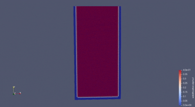

# CoCrFeMnNi High Entropy Alloy Solidification Simulation

<div align="center">




**Computational Fluid Dynamics Modeling of High Entropy Alloy Casting**

[Documentation](#documentation) | [Quick Start](#quick-start) | [Results](#results) | [Contributing](#contributing) | [License](#license)

---

</div>

## Table of Contents

- [Overview](#overview)
- [Features](#features)
- [System Requirements](#system-requirements)
- [Installation](#installation)
- [Quick Start](#quick-start)
- [Simulation Details](#simulation-details)
- [Results and Visualization](#results-and-visualization)
- [Case Structure](#case-structure)
- [Customization](#customization)
- [Troubleshooting](#troubleshooting)
- [Documentation](#documentation)
- [Contributing](#contributing)
- [Author](#author)
- [License](#license)
- [Acknowledgments](#acknowledgments)

---

## Overview

This project provides a complete computational framework for simulating the solidification behavior of CoCrFeMnNi high entropy alloy during casting processes. The simulation captures the complex interplay between heat transfer, natural convection, and phase transformation using OpenFOAM's computational fluid dynamics capabilities.

High entropy alloys represent an important class of materials with exceptional mechanical properties. Understanding their solidification behavior is crucial for optimizing casting processes and controlling microstructure formation.

### Key Highlights

- Complete OpenFOAM case setup for HEA solidification
- Coupled heat transfer and fluid flow modeling
- Enthalpy-porosity method for phase change
- Natural convection effects during solidification
- Validated boundary conditions for realistic casting scenarios
- Automated case generation with Python script

---

## Features

### Physical Models

- **Heat Transfer**: Conduction and convection with temperature-dependent properties
- **Phase Change**: Solidification with latent heat release using enthalpy-porosity method
- **Natural Convection**: Buoyancy-driven flow in the liquid region
- **Mushy Zone**: Transition region modeling between solid and liquid phases

### Computational Capabilities

- Two-dimensional rectangular mold geometry
- Structured hexahedral mesh (5,000 cells)
- Adaptive time stepping with Courant number control
- PIMPLE algorithm for pressure-velocity coupling
- GAMG solver for pressure with DIC Gauss-Seidel smoothing
- Laminar flow modeling appropriate for casting conditions

### Material Properties (CoCrFeMnNi)

| Property | Value | Units |
|----------|-------|-------|
| Density | 8,100 | kg/m³ |
| Liquidus Temperature | 1,723 | K (1,450°C) |
| Solidus Temperature | 1,633 | K (1,360°C) |
| Latent Heat of Fusion | 270,000 | J/kg |
| Specific Heat (Liquid) | 595 | J/(kg·K) |
| Thermal Conductivity (Liquid) | 28.0 | W/(m·K) |
| Dynamic Viscosity | 0.006 | Pa·s |

---

## System Requirements

### Software Dependencies

- **Operating System**: Linux (Ubuntu 20.04+), Windows WSL2, or macOS
- **OpenFOAM**: Version 2312 or 2412 (tested and verified)
- **Python**: Version 3.8 or higher
- **ParaView**: Version 5.x for visualization (optional but recommended)

### Hardware Recommendations

- **CPU**: Multi-core processor (4+ cores recommended)
- **RAM**: Minimum 4 GB (8 GB recommended)
- **Storage**: 500 MB free space for case files and results
- **Display**: For ParaView visualization

---

## Installation

### Step 1: Install OpenFOAM

#### For Ubuntu/Debian:

```bash
# Add OpenFOAM repository
sudo sh -c "wget -O - https://dl.openfoam.org/gpg.key | apt-key add -"
sudo add-apt-repository http://dl.openfoam.org/ubuntu

# Update and install
sudo apt-get update
sudo apt-get install openfoam2412

# Source OpenFOAM environment
echo "source /usr/lib/openfoam/openfoam2412/etc/bashrc" >> ~/.bashrc
source ~/.bashrc
```

#### For Windows WSL2:

Install Ubuntu from Microsoft Store, then follow the Ubuntu instructions above.

### Step 2: Install ParaView (Optional)

```bash
# Ubuntu
sudo apt-get install paraview

# Or download from https://www.paraview.org/download/
```

### Step 3: Clone This Repository

```bash
git clone https://github.com/Computational-Materials-Research-Group/CoCrFeMnNi-High-Entropy-Alloy-Solidification-Simulation.git
cd CoCrFeMnNi-High-Entropy-Alloy-Solidification-Simulation
```

---

## Quick Start

### Method 1: Automated Setup (Recommended)

```bash
# Run the Python setup script
python3 setup_hea_solidification.py

# Navigate to the created case
cd HEA_Solidification

# Make run script executable
chmod +x run.sh

# Run the simulation
./run.sh
```

### Method 2: Manual Setup

```bash
# Copy the case directory
cp -r HEA_Solidification /path/to/your/workspace

# Navigate to case
cd /path/to/your/workspace/HEA_Solidification

# Generate mesh
blockMesh

# Check mesh quality
checkMesh

# Run simulation
buoyantPimpleFoam > log.simulation 2>&1
```

### Monitoring Progress

In a separate terminal:

```bash
cd HEA_Solidification
tail -f log.simulation
```

You should see output like:

```
Time = 1
Time = 2
Time = 3
...
```

---

## Simulation Details

### Geometry

- **Domain**: 2D rectangular casting mold
- **Dimensions**: 0.1 m (width) × 0.2 m (height) × 0.01 m (depth)
- **Mesh**: 50 × 100 × 1 cells (structured hexahedral)
- **Total Cells**: 5,000

### Boundary Conditions

| Boundary | Temperature | Type |
|----------|-------------|------|
| Bottom | 300 K (27°C) | Fixed (cold chill) |
| Left Wall | 500 K (227°C) | Fixed (cooled mold) |
| Right Wall | 500 K (227°C) | Fixed (cooled mold) |
| Top | Zero Gradient | Insulated (riser) |
| Front/Back | Empty | 2D simulation |

**Initial Condition**: 1,773 K (50 K superheat above liquidus)

### Solver Configuration

- **Solver**: `buoyantPimpleFoam`
- **Turbulence Model**: Laminar (appropriate for casting conditions)
- **Time Stepping**: Adaptive with maximum Courant number = 0.5
- **Simulation Time**: 100 seconds (physical time)
- **Write Interval**: 1 second
- **Pressure-Velocity Coupling**: PIMPLE algorithm

### Physical Models

#### Solidification Model

Uses `solidificationMeltingSource` with:
- **Method**: Enthalpy-porosity technique
- **Mushy Zone Constant (Cu)**: 1×10⁷
- **Solid Fraction Threshold (q)**: 0.001

#### Gravity

- **Direction**: Negative Y-axis
- **Magnitude**: 9.81 m/s²

---

## Results and Visualization

### Opening Results in ParaView

#### From Windows:

1. Open ParaView application
2. File → Open
3. Navigate to: `C:\Users\[YourUsername]\Downloads\HEA_Solidification`
4. Select: `HEA_Solidification.foam`
5. Click "Apply" in Properties panel

#### From Linux/WSL:

```bash
cd HEA_Solidification
paraview HEA_Solidification.foam &
```

### Available Fields

| Field Name | Description | Range |
|------------|-------------|-------|
| `T` | Temperature distribution | 300 - 1773 K |
| `U` | Velocity vectors | ~10⁻⁸ m/s |
| `solidification:alpha1` | Liquid fraction | 0 (solid) - 1 (liquid) |
| `p_rgh` | Modified pressure | ~101325 Pa |

### Visualization Tips

#### Temperature Distribution

1. Select field: `T`
2. Apply color map (rainbow or thermal)
3. Shows cooling pattern from walls inward

#### Solidification Front

1. Select field: `solidification:alpha1`
2. Filters → Contour
3. Set contour value: 0.5 (solid-liquid interface)
4. Visualizes the moving solidification boundary

#### Velocity Vectors

1. Select field: `U`
2. Filters → Glyph
3. Glyph Type: Arrow
4. Shows natural convection patterns

#### Animation

1. Use time controls at top of ParaView
2. Click Play to animate solidification process
3. File → Save Animation to export

### Expected Results

- **Solidification Pattern**: Starts from cold boundaries (bottom and sides)
- **Liquid Pool**: Progressively shrinks upward and toward center
- **Natural Convection**: Hot liquid rises through center, cool liquid sinks at walls
- **Final State**: Complete solidification in approximately 100 seconds

---

## Case Structure

```
HEA_Solidification/
├── 0/                          # Initial conditions
│   ├── T                       # Temperature field
│   ├── U                       # Velocity field
│   ├── p                       # Pressure field
│   ├── p_rgh                   # Modified pressure
│   └── alphat                  # Turbulent thermal diffusivity
├── constant/                   # Material properties
│   ├── fvOptions               # Solidification model
│   ├── g                       # Gravity vector
│   ├── thermophysicalProperties # Thermo properties
│   ├── transportProperties     # Transport properties
│   ├── turbulenceProperties    # Turbulence model
│   └── polyMesh/               # Mesh data (generated)
├── system/                     # Numerical settings
│   ├── blockMeshDict           # Mesh generation
│   ├── controlDict             # Time control
│   ├── fvSchemes               # Discretization schemes
│   └── fvSolution              # Solver settings
├── run.sh                      # Execution script
├── README.md                   # This file
└── HEA_Solidification.foam     # ParaView file (generated)
```

---

## Customization

### Changing Cooling Rate

Edit `0/T` to modify boundary temperatures:

```cpp
boundaryField
{
    bottom
    {
        type            fixedValue;
        value           uniform 300;  // Change this value
    }
    
    left
    {
        type            fixedValue;
        value           uniform 500;  // Change this value
    }
}
```

**Effect**: Lower temperatures → faster cooling → finer grain structure

### Modifying Geometry

Edit `system/blockMeshDict`:

```cpp
vertices
(
    (0 0 0)
    (0.1 0 0)         // Change X for width
    (0.1 0.2 0)       // Change Y for height
    ...
);

blocks
(
    hex (0 1 2 3 4 5 6 7) (50 100 1)  // Change (Nx Ny Nz) for mesh density
);
```

### Adjusting Simulation Time

Edit `system/controlDict`:

```cpp
endTime         100;    // Total simulation time (seconds)
deltaT          0.01;   // Initial time step (seconds)
writeInterval   1;      // Output frequency (seconds)
```

### Material Properties

Edit `constant/thermophysicalProperties` and `constant/fvOptions` to change:
- Density
- Thermal conductivity
- Specific heat
- Liquidus/Solidus temperatures
- Latent heat

---

## Troubleshooting

### Issue: Simulation Crashes

**Symptoms**: Solver aborts with FOAM FATAL ERROR

**Solutions**:

1. Check mesh quality:
   ```bash
   checkMesh
   ```

2. Reduce time step in `system/controlDict`:
   ```cpp
   deltaT          0.001;  // Smaller time step
   maxCo           0.2;    // Stricter Courant limit
   ```

3. Check log file for specific errors:
   ```bash
   grep -i error log.simulation
   grep -i fatal log.simulation
   ```

### Issue: No Time Directories Created

**Symptoms**: Only `0/` directory exists after running

**Solutions**:

1. Check if simulation actually ran:
   ```bash
   tail -50 log.simulation
   ```

2. Look for initialization errors in log

3. Verify all initial condition files exist in `0/`

### Issue: ParaView Shows No Fields

**Symptoms**: Only "Solid Color" available in dropdown

**Solutions**:

1. Ensure simulation has generated time directories (`1/`, `2/`, etc.)

2. Close and reopen ParaView

3. Click "Apply" button in Properties panel

4. Check if `.foam` file exists:
   ```bash
   ls -la *.foam
   ```

### Issue: Mesh Generation Fails

**Symptoms**: blockMesh reports errors

**Solutions**:

1. Check `system/blockMeshDict` syntax

2. Verify vertex numbering is correct

3. Ensure all blocks reference valid vertices

---

## Documentation

### Additional Resources

- [OpenFOAM User Guide](https://www.openfoam.com/documentation/user-guide)
- [OpenFOAM Documentation](https://doc.openfoam.com/)
- [ParaView Guide](https://www.paraview.org/documentation/)
- [solidificationMeltingSource Documentation](https://cpp.openfoam.org/v6/classFoam_1_1fv_1_1solidificationMeltingSource.html)

---

## Contributing

Contributions are welcome! This project is open for improvements and extensions.

### How to Contribute

1. **Fork the Repository**

2. **Clone Your Fork**
   ```bash
   git clone https://github.com/[YourUsername]/CoCrFeMnNi-High-Entropy-Alloy-Solidification-Simulation.git
   cd CoCrFeMnNi-High-Entropy-Alloy-Solidification-Simulation
   ```

3. **Create a Branch**
   ```bash
   git checkout -b feature/your-feature-name
   ```

4. **Make Changes**
   - Add new features
   - Fix bugs
   - Improve documentation
   - Add validation cases

5. **Commit and Push**
   ```bash
   git add .
   git commit -m "Description of changes"
   git push origin feature/your-feature-name
   ```

6. **Submit Pull Request**
   - Go to GitHub and create a Pull Request
   - Describe your changes clearly
   - Reference any related issues

### Contribution Ideas

- Three-dimensional geometry implementation
- Additional HEA compositions (AlCoCrFeNi, MoNbTaW, etc.)
- Grain structure modeling integration
- Validation against experimental data
- Automated post-processing scripts
- Additional boundary condition templates
- Performance optimization
- Docker container for easy deployment

### Code Standards

- Follow OpenFOAM case structure conventions
- Comment complex configurations
- Update documentation for new features
- Test changes before submitting
- Use meaningful commit messages

---

## Author

**Akshansh Mishra**

- GitHub: [@akshansh11](https://github.com/akshansh11)
- Organization: [@Computational-Materials-Research-Group](https://github.com/Computational-Materials-Research-Group)
- LinkedIn: [https://www.linkedin.com/in/akshansh11/](https://www.linkedin.com/in/akshansh11/)

### About the Project

This simulation framework was developed as part of computational materials engineering research focused on optimizing high entropy alloy manufacturing processes. The goal is to provide an accessible, open-source tool for researchers and engineers working with advanced metallic materials.

---

## License

<div align="center">

### Creative Commons Attribution-NonCommercial 4.0 International


</div>

This work is licensed under a [Creative Commons Attribution-NonCommercial 4.0 International License](http://creativecommons.org/licenses/by-nc/4.0/).

### You are free to:

- **Share** — copy and redistribute the material in any medium or format
- **Adapt** — remix, transform, and build upon the material

### Under the following terms:

- **Attribution** — You must give appropriate credit, provide a link to the license, and indicate if changes were made. You may do so in any reasonable manner, but not in any way that suggests the licensor endorses you or your use.

- **NonCommercial** — You may not use the material for commercial purposes.

- **No additional restrictions** — You may not apply legal terms or technological measures that legally restrict others from doing anything the license permits.

### Notices:

You do not have to comply with the license for elements of the material in the public domain or where your use is permitted by an applicable exception or limitation.

No warranties are given. The license may not give you all of the permissions necessary for your intended use. For example, other rights such as publicity, privacy, or moral rights may limit how you use the material.

For the full legal text, see: https://creativecommons.org/licenses/by-nc/4.0/legalcode

### Citation

If you use this work in academic research, please cite:

```bibtex
@software{mishra2025hea_solidification,
  author = {Mishra, Akshansh},
  title = {CoCrFeMnNi High Entropy Alloy Solidification Simulation using OpenFOAM},
  year = {2025},
  publisher = {GitHub},
  url = {https://github.com/Computational-Materials-Research-Group/CoCrFeMnNi-High-Entropy-Alloy-Solidification-Simulation},
  note = {Licensed under CC BY-NC 4.0}
}
```

---

## Acknowledgments

### Software

- **OpenFOAM Foundation** - For the open-source CFD toolkit
- **ParaView** - For visualization capabilities
- **Python Community** - For scripting tools

### Community

This project builds upon established methods in computational solidification modeling and leverages the extensive capabilities of the OpenFOAM platform.

---

## Support

### Getting Help

- **Issues**: Report bugs or request features via [GitHub Issues](https://github.com/Computational-Materials-Research-Group/CoCrFeMnNi-High-Entropy-Alloy-Solidification-Simulation/issues)
- **Discussions**: Join the conversation in [GitHub Discussions](https://github.com/Computational-Materials-Research-Group/CoCrFeMnNi-High-Entropy-Alloy-Solidification-Simulation/discussions)
- **Documentation**: Check the [Wiki](https://github.com/Computational-Materials-Research-Group/CoCrFeMnNi-High-Entropy-Alloy-Solidification-Simulation/wiki) for detailed guides

### Community

- OpenFOAM Forum: [CFD Online](https://www.cfd-online.com/Forums/openfoam/)
- ParaView Discourse: [ParaView Community](https://discourse.paraview.org/)

---

## Project Status

**Current Version**: 1.0.0 (December 2025)

**Status**: Active Development

### Roadmap

- [x] Complete 2D solidification simulation
- [x] Python automation script
- [x] ParaView visualization support
- [ ] 3D geometry implementation
- [ ] Additional HEA compositions
- [ ] Microstructure coupling
- [ ] Experimental validation
- [ ] Docker containerization
- [ ] Automated testing suite

---

<div align="center">

**Built with OpenFOAM | Powered by Python | Visualized with ParaView**

**Star this repository if you find it useful!**

[](https://github.com/Computational-Materials-Research-Group/CoCrFeMnNi-High-Entropy-Alloy-Solidification-Simulation)
[](https://github.com/Computational-Materials-Research-Group/CoCrFeMnNi-High-Entropy-Alloy-Solidification-Simulation/fork)

---

Copyright © 2025 Akshansh Mishra | Licensed under CC BY-NC 4.0

</div>
